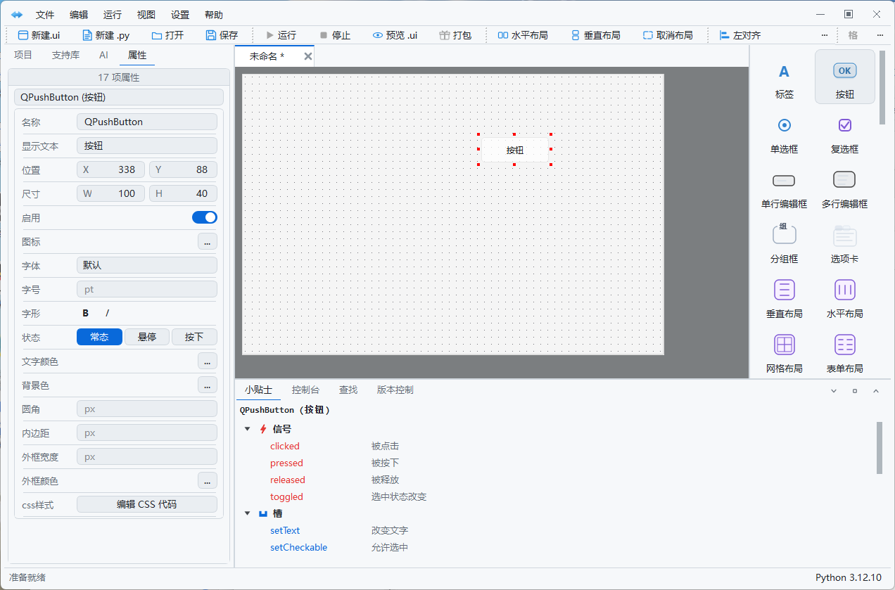
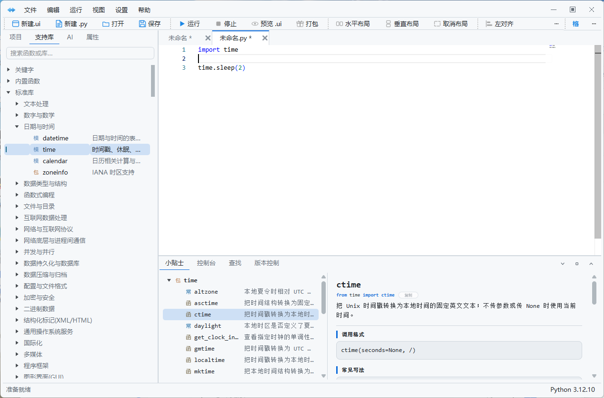
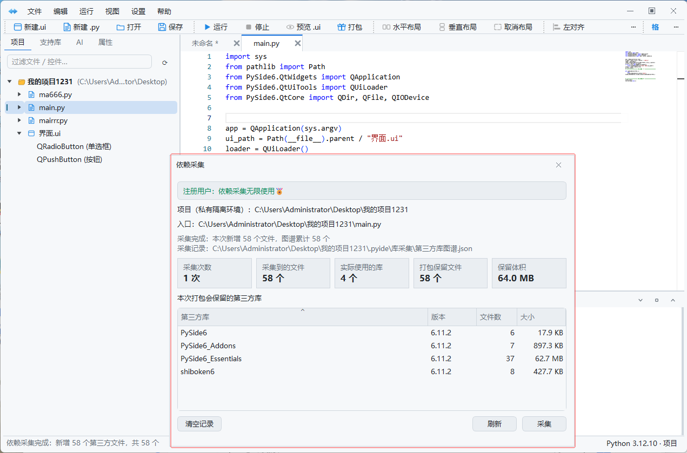
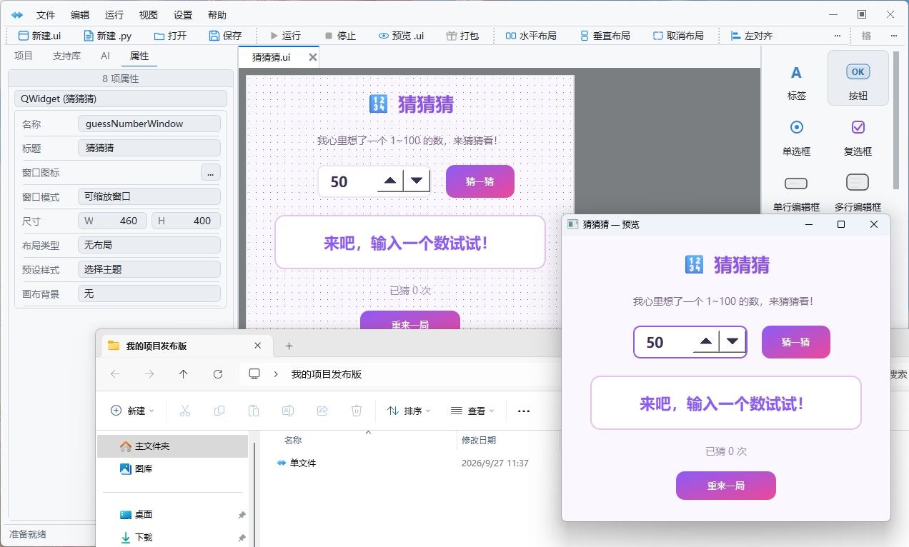

# PyIDE

面向中文 Python 开发者的绿色集成开发环境。

PyIDE 是一款专注于 Python 开发和桌面应用打包的 IDE。它兼顾代码编辑、项目运行、可视化界面设计和一键打包，下载解压即可使用，不需要复杂安装，也不需要额外部署开发环境。

> 本仓库公开的是 PyIDE 的简易源码与可视化设计示例。完整软件请前往 [Releases](../../releases) 下载。

## 为什么选择 PyIDE

### 下载即用的绿色体验

- 免安装，解压后即可运行。
- 免部署，不需要手动配置复杂的开发环境。
- 适合个人开发者、教学演示和需要快速交付的桌面项目。

### 兼容现有 Python 工作流

PyIDE 面向真实 Python 项目设计，能够兼容常见的 Python 项目结构、解释器和依赖使用方式。使用 VS Code 或 PyCharm 编写过的 Python 项目，可以继续在 PyIDE 中打开和开发。

它不是只能编写示例代码的编辑器，而是可以参与实际项目开发的 Python 工具。

### 可视化界面设计

通过拖拽即可搭建桌面界面：

- 拖放按钮、标签、输入框、文本框和常用容器。
- 在画布中移动、缩放和编辑控件。
- 使用属性面板修改文本、尺寸、占位提示和布局。
- 支持垂直、水平、网格和表单布局。
- 支持 Qt Designer .ui 文件的读取、保存和 Python 转换。

即使不熟悉复杂的 Qt 布局代码，也可以快速完成桌面界面原型和实际界面。

### 一键打包桌面程序

PyIDE 提供面向桌面应用的一键打包能力，减少从项目到可分发程序之间的重复配置工作。

在已覆盖的常见桌面项目场景中，打包成功率接近 100%，适合将 Python 项目快速交付给没有 Python 环境的用户。

### 更可靠的依赖分析

PyIDE 会从项目、运行环境和第三方库使用关系等多个层面分析打包依赖，尽量避免：

- 打包后缺少依赖，程序在用户电脑上无法启动。
- 把大量不需要的依赖一并打进安装包。
- 本地运行正常，换一台电脑就出现导入错误。

目标很简单：该带的依赖带全，不需要的依赖尽量不带。对于动态导入、插件系统和运行时生成模块等特殊场景，仍建议在发布前进行一次实际环境测试。

### 适合生产项目

PyIDE 当前版本已经具备用于实际 Python 桌面项目开发和发布的能力，不只是概念演示或界面样例。

如果你正在做内部工具、数据处理软件、自动化工具、运维工具或其他 Python 桌面程序，PyIDE 可以作为一套完整的开发与打包工具使用。

## 完整版功能

完整绿色版包含以下能力：

- Python 代码编辑、自动补全和项目搜索。
- 一键运行与调试。
- 变量查看、调用栈和运行配置。
- 可视化 Qt 界面设计。
- .ui 文件编辑与转换。
- 第三方库管理和依赖分析。
- 一键打包桌面程序。
- 中文报错提示和工作区布局。
- Git/版本管理相关工作流。

完整版本的实际功能和发布内容以 [Releases](../../releases) 中的版本说明为准。

## 公开源码 Demo

本仓库中的代码用于展示 PyIDE 可视化设计器的核心实现，包含：

- 新建、打开和保存 Qt Designer .ui 文件。
- 从控件箱拖拽控件和布局。
- 在画布中选择、移动、缩放、复制和删除控件。
- 使用属性面板编辑窗口和控件属性。
- 撤销和重做。
- 将当前界面导出为可运行的 PySide6 Python 文件。
- 底部控制台和基础操作日志。

源码版本保持精简，适合阅读、学习和二次实验。完整 IDE 的代码编辑器、运行时内核、打包引擎和其他商业模块不包含在本仓库中。

## 运行源码 Demo

建议使用 Python 3.12 或更高版本。

~~~powershell
python -m venv .venv
.\.venv\Scripts\python -m pip install -r requirements.txt
.\.venv\Scripts\python main.py
~~~

如果已经安装 PySide6，也可以直接运行：

~~~powershell
python main.py
~~~

## 下载完整软件

请前往 [Releases](../../releases) 下载完整绿色版。

GitHub 自动生成的 "Source code (zip)" 只包含本仓库的公开源码，不是完整软件。完整软件压缩包应从对应 Release 的 Assets 区域下载。

完整软件通常会按系统和架构区分，例如：

~~~text
PyIDE-Windows-x64-v版本号.zip
~~~

## 产品截图

### 可视化界面设计

拖拽控件、编辑属性，并在画布中完成 Qt 桌面界面设计。

### Python 代码编辑

支持 Python 项目编辑、标准库浏览和代码文档查看。

### 第三方依赖采集

打包前采集项目实际使用的第三方库和文件，帮助减少漏依赖与冗余依赖。

### 打包后的桌面程序

从项目开发到桌面程序运行，保持完整的交付链路。

## 项目文件

~~~text
main.py            Demo 入口与主窗口
model.py           UI 节点和画布数据模型
ui_json_codec.py   .ui 文件读取、保存和 Python 导出
canvas.py             可视化设计画布
canvas_interaction.py 画布交互和布局辅助
property_panel.py     属性编辑面板
~~~

## 许可

本 Demo 采用仓库内的 [PyIDE Demo Source License](LICENSE)。它是源码可见许可，不是 OSI 认可的开源许可证。个人学习、测试和非商业修改请遵守许可证约定；商业使用、转售或将其包装为竞争产品，请先取得授权。

PySide6、Qt 以及其他第三方组件分别遵循其自身许可证。本仓库不包含这些第三方组件的源代码或二进制文件。

## 反馈

提交问题时，请尽量附带：

- 操作系统和系统架构。
- PyIDE 版本。
- Python 版本。
- 复现步骤。
- 完整报错信息。

欢迎反馈界面设计、打包成功率、依赖识别和桌面程序运行方面的问题。
